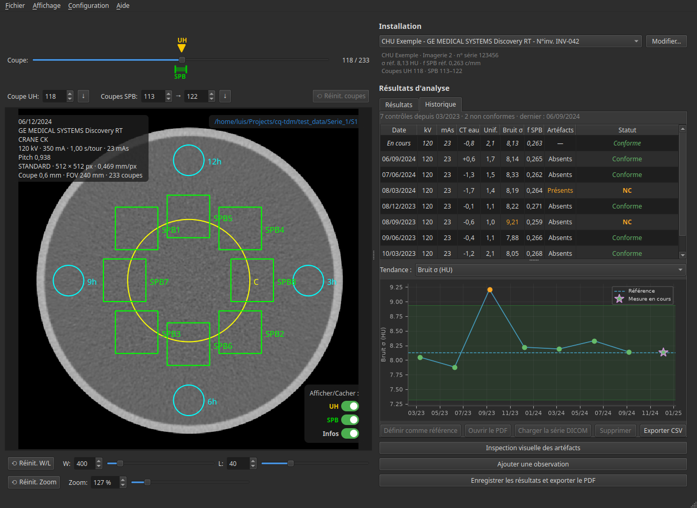
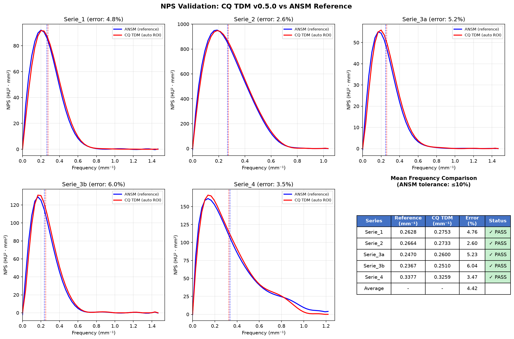
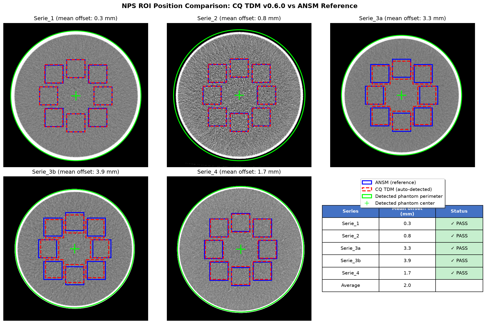

# CQ TDM

Logiciel d'analyse des images de fantômes d'eau pour le contrôle qualité des tomodensitomètres.

## Présentation

CQ TDM (ou cq-tdm) analyse les images DICOM de fantômes cylindriques remplis d'eau pour évaluer le nombre CT de l'eau, l'uniformité, la magnitude du bruit, le spectre de puissance du bruit et les artefacts. Ce logiciel suit la décision ANSM du 18/12/2025 fixant les modalités du contrôle de qualité des tomodensitomètres.



## Fonctionnalités

- **Chargement d'images DICOM** : Charger et visualiser des séries DICOM CT
- **Analyse du fantôme d'eau** :
  - Nombre CT de l'eau
  - Uniformité
  - Constance de la magnitude du bruit
- **Spectre de Puissance du Bruit (SPB/NPS)** :
  - Calcul du SPB 1D avec ajustement polynomial de degré 11
  - Calcul de la fréquence moyenne
  - Affichage du spectre
- **Gestion des ROI** :
  - Détection automatique du fantôme et placement des ROI
  - Export des ROI (JSON, compatible avec IQMetrix-CT)
- **Génération de rapports PDF**
- **Base de données des appareils** :
  - Enregistrement des valeurs de référence (magnitude du bruit et fréquence moyenne du SPB) et des informations d'identification
  - Détection automatique des appareils enregistrés
  - Possibilité d'utiliser une base de données commune et en réseau entre plusieurs postes
  

## Cadre réglementaire

**Avertissement** : L'auteur ne garantit pas la conformité avec la décision ANSM du 18/12/2025, ni la validité des résultats. L'utilisateur est responsable de la vérification et de la validation des mesures avant toute utilisation réglementaire.

L'auteur s'efforce à ne pas changer les méthodes de calcul entre chaque version majeure du logiciel. Une attention à la reproductibilité des résultats doit tout de même être maintenue par l'utilisateur à chaque mise à jour.


## Spectre de puissance du bruit (SPB)

La décision ANSM ne précise pas les détails de la méthode de calcul du SPB. CQ TDM a pour objectif de se rapprocher au plus près de la méthode utilisée par [IQMetrix-CT](https://github.com/SFPM/iQMetrix-CT) et des résultats de référence disponibles sur le site de l'ANSM.

Un protocole de test automatisé est disponible avec le code source du logiciel. Il compare les résultats du calcul de la fréquence moyenne du SPB avec les références fournies par l'ANSM. Il peut être exécuté avec pytest : 

```bash
# Lancer les tests de validation SPB
pytest tests/test_nps_validation.py -v
```

Les résultats de la version actuelle sont présentés ci-dessous :





## Installation

Plusieurs méthodes d'installation sont disponibles. Toutes peuvent être réalisées sur un poste de travail sans droits administrateur.

### Windows

**Méthode recommandée : Programme d'installation**

1. Téléchargez [`CQ_TDM_Setup_Windows.exe`](https://github.com/lammour/cq-tdm/releases/latest/download/CQ_TDM_Setup_Windows.exe)
2. Double-cliquez pour lancer l'assistant d'installation

L'assistant installe l'application, crée un raccourci dans le menu Démarrer et permet la désinstallation via « Ajout/Suppression de programmes ».

> **Note :** L'exécutable n'est pas signé numériquement. Windows affichera un avertissement de sécurité. Cliquez sur "Informations complémentaires" → "Exécuter quand même" pour continuer.

**Alternative : Exécutable portable**

Téléchargez [`CQ_TDM_Portable_Windows.exe`](https://github.com/lammour/cq-tdm/releases/latest/download/CQ_TDM_Portable_Windows.exe) — aucune installation requise.

> **Note :** L'exécutable n'est pas signé numériquement. Windows affichera un avertissement de sécurité. Cliquez sur "Informations complémentaires" → "Exécuter quand même" pour continuer.

### GNU/Linux

Testé sous Ubuntu 24.04.3 LTS.

**Méthode recommandée : Script d'installation**

1. Téléchargez le script d'installation :
   ```bash
   curl -O https://raw.githubusercontent.com/lammour/cq-tdm/main/installers/install-linux.sh
   ```
2. Rendez le script exécutable :
   ```bash
   chmod +x install-linux.sh
   ```
3. Exécutez le script :
   ```bash
   ./install-linux.sh
   ```

Le script installe l'application sous le nom **CQ TDM** et crée un raccourci dans le menu Applications.

**Alternative : Exécutable portable**

Téléchargez [`CQ_TDM_Portable_Linux`](https://github.com/lammour/cq-tdm/releases/latest/download/CQ_TDM_Portable_Linux) — aucune installation requise.

### pip / pipx

1. Installez pip ou [pipx](https://pipx.pypa.io/) (recommandé)

2. Si vous utilisez pip, la création d'un environnement virtuel est fortement recommandée

3. Installez le logiciel :
  - Avec pip :
  ```bash
  pip install cq-tdm
  ```
  - Avec pipx :
  ```bash
  pipx install cq-tdm
  ```

## Installation pour le développement

Testé sous Ubuntu 24.04.3 LTS avec Python 3.12.

```bash
# Cloner le dépôt
git clone https://github.com/lammour/cq-tdm.git
cd cq-tdm

# Créer et activer l'environnement virtuel
python -m venv .venv
source .venv/bin/activate

# Installer en mode développement
pip install -e .
```

## Utilisation

1. Lancer l'application
2. Charger une série DICOM
3. Modifier les détails de l'appareil, les valeurs de référence et les coupes de mesure
4. Enregistrer
5. Vérifier les artéfacts
6. Générer le rapport PDF
